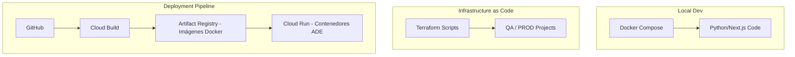

# Plan de Implementación: Ambientes QA y Producción - Proyecto ADE (Atlas de Datos Estadísticos)

Este documento detalla el plan estratégico para la expansión de la infraestructura del proyecto **Atlas de Datos Estadísticos (ADE)** en Google Cloud Platform (GCP), elevando el estado actual (Desarrollo) hacia ambientes robustos de **Pruebas (QA)** y **Producción (PROD)**.

---

## 1. Análisis del Estado Actual (Ambiente Desarrollo)

El proyecto base `atlas-datos-estadisticos-desa` ha sido identificado como el entorno de integración para el análisis estadístico a escala. 

### Infraestructura Clave:
- **Gestión de Cuentas:** El acceso principal se centraliza en **jlcuenca@datalum.mx** (Datalum Analytics).
- **Contenerización (Docker):** El proyecto se basa en una arquitectura de **microservicios dockerizados** para asegurar la portabilidad y paridad entre ambientes (Local -> DESA -> QA -> PROD).
- **Infraestructura como Código (Terraform):** Toda la provisión de recursos en el proyecto crecientemente complejo se gestionará mediante **Terraform (HCL)** para garantizar consistencia y facilitar el crecimiento modular.

### Hallazgos de Seguridad/Infraestructura:
- Se requiere la habilitación del **Cloud Build API** y el uso de **Artifact Registry** para el almacenamiento de imágenes Docker.
- Se observa la necesidad de migrar configuraciones ad-hoc a archivos `.tf`.

---

## 2. Estrategia de Ambientes Multi-Entorno

| Ambiente | Proyecto ID (Propuesto) | Propósito | Nivel de Escalabilidad |
| :--- | :--- | :--- | :--- |
| **DESA** | `atlas-datos-estadisticos-desa` | Desarrollo y CI. | Bajo (f1-micro) |
| **QA** | `atlas-datos-estadisticos-qa` | Validación y UAT. | Medio (n1-standard-1) |
| **PROD** | `atlas-datos-estadisticos-prod` | Usuarios Finales. | Alto (Auto-scaling Cloud Run) |

---

## 3. Plan de Acción (Sprint 1) - Enfoque Datalum

### Tarea 1: Provisión con Terraform (Semana 1)
- [ ] **Estructura de Directorios:** Crear carpetas `infra/envs/qa` e `infra/envs/prod`.
- [ ] **Módulos Reutilizables:** Definir módulos para Cloud Run, Cloud SQL y Buckets.
- [ ] **State Management:** Configurar un bucket GCS para el `terraform.tfstate` remoto.

### Tarea 2: Dockerización Masiva (Semana 1-2)
- [ ] **Multi-stage Builds:** Optimizar `Dockerfile` para reducir el tamaño de las imágenes (usando alpine/slim).
- [ ] **Secrets via Docker:** Implementar el paso de variables de entorno seguras desde Cloud Build hacia los contenedores.
- [ ] **Local Testing:** Asegurar que `docker-compose up` replique el entorno de DESA localmente.

### Tarea 3: CI/CD Pipeline Robusto (Semana 2)
- [ ] **Artifact Registry:** Configurar un repositorio de imágenes Docker regional.
- [ ] **Cloud Build v2:** Implementar triggers que ejecuten `terraform plan` antes de cada `apply` automático en QA/PROD.

---

## 4. Diagrama de Arquitectura Modular

---

## 5. Consideraciones para el Crecimiento del Proyecto

1. **Modularidad:** Cada nueva funcionalidad estadística (ej. motor de inferencia) deberá ser un nuevo servicio dockerizado.
2. **Monitoreo:** Integrar Google Cloud Monitoring para alertar sobre consumo de CPU/Memoria antes de que impacte al usuario.
3. **Escalabilidad de DB:** Considerar **BigQuery** para el almacenamiento de datos históricos pesados si la carga de SQL crece exponencialmente.

---
*Mantenido por: jlcuenca@datalum.mx - Proyecto ADE 2026*
